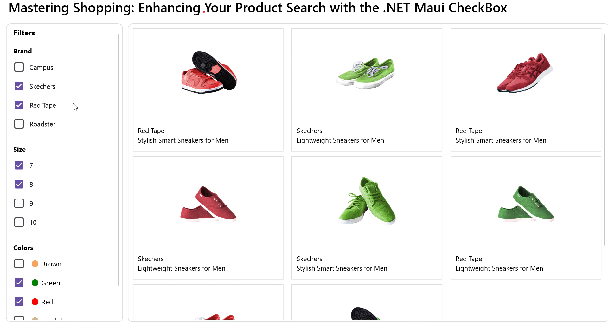

# Syncfusion-CheckBox-filtering-in-.NET-MAUI
This example demonstrates how the .NET MAUI CheckBox revolutionizes the shopping experience by enabling users to refine their products. Follow the steps below to create a project and filter products from the available items using Maui CheckBox.

## Create a simple Maui CheckBox 

Start by referring to the Syncfusion .NET Maui CheckBox documentation to create a Maui application and include the Maui CheckBox. The IsChecked property is used to indicate whether the filtering is enabled or not in the predefined collection.

```
<buttons:SfCheckBox Text="Campus" IsChecked="True"/>
```

## Create a Simple Maui ListView

You can refer to the Syncfusion .NET Maui ListView documentation to include the Maui ListView. It is used to render a set of data items using Maui views or custom templates. Data can be easily grouped, sorted, and filtered.	

```
<listView:SfListView>
    <listView:SfListView.ItemTemplate>
        <DataTemplate>
             . . .
        </DataTemplate>
    </listView:SfListView.ItemTemplate>
</listView:SfListView>
```

##	Populating items using data binding

**Step 1:** Define a simple model class ProductInfo with fields like Brand, Description, Size, Color, and Image, as shown in the example code below:

```
 public class ProductInfo
 {
     public string Brand { get; set; }
     public string Description { get; set; }
     public string Size { get; set; }
     public Color Color { get; set; }
     public string Image { get; set; }

     public ProductInfo(string brand, string image, string size, Color color, string description)
     {
         Brand = brand;
         Description = description;
         Size = size;
         Color = color;
         Image = image;
     }
 }

```

**Step 2:** Create a ViewModel class with a ProductInfo collection property initialized with the required number of data objects. Save it in a new class file named ProductInfoViewModel.cs, as shown in the following code example:

```
public class ProductInfoViewModel
{
    public ObservableCollection<ProductInfo> Products1 { get; set; }
    public GettingStartedViewModel()
    {
        Products1 = new ObservableCollection<Product>();
        string description1 = "Lightweight Sneakers for Men";
        string description2 = "Stylish Smart Sneakers for Men";
        Products1.Add(new Product("Campus", "brownshoe-01.png", "6   7   8", Colors.Brown, description1));
        Products1.Add(new Product("Campus ", "greenshoe-02.png", "6   7   8   9   10", Colors.Green, description2));
        Products1.Add(new Product("Campus ", "redshoe-03.png", "7   8   9   10 ", Colors.Red, description2));
. . .
    }
}

```

**Step 3:** Add multiple CheckBoxes to filter products with the exact specifications. Then bind the data collection to the ListView's ItemsSource.

```
<Grid>
    <Border>
        <Label Text="Filters" HorizontalOptions="Start"/>
 
        <StackLayout>
                <Label Text="Brand" />
                <Syncfusion:SfCheckBox HorizontalOptions="Start" Text="Campus" BindingContext="{x:StaticResource ViewModel}" IsChecked="{Binding BrandFilterChecked1}"/>
                <Syncfusion:SfCheckBox HorizontalOptions="Start" Text="Skechers"  BindingContext="{x:StaticResource ViewModel}" IsChecked="{Binding BrandFilterChecked2}"/>
                <Syncfusion:SfCheckBox HorizontalOptions="Start" Text="Red Tape"   BindingContext="{x:StaticResource ViewModel}" IsChecked="{Binding BrandFilterChecked3}"/>
                <Syncfusion:SfCheckBox HorizontalOptions="Start" Text="Roadster"  BindingContext="{x:StaticResource ViewModel}" IsChecked="{Binding BrandFilterChecked4}"/>
        </StackLayout>
  
. . .
  </Border> 

   <Border>              
    <listView:SfListView BindingContext="{x:StaticResource ViewModel}" ItemsSource="{Binding Filtered}">
        <listView:SfListView.ItemTemplate>
            <DataTemplate>
                . . .
            </DataTemplate>
        </listView:SfListView.ItemTemplate>
    </listView:SfListView>
  </Border> 
</Grid>
```

## Filter products

Filter the products based on the state of the CheckBox, as demonstrated in the example code below:

```
private ObservableCollection<Product> GetFilteredProducts()
{
    var filteredList = new ObservableCollection<ProductInfo>();

    if (brandFilterChecked1)
    {
        foreach (var product in Products1)
        {
            if (IsColorChecked(product) || IsColorUnfiltered())
                filteredList.Add(product);
        }
    }
    
...

 List<ProductInfo> products = new List<ProductInfo>();
 products = filteredList.OrderBy(x => Random.Shared.Next()).ToList<ProductInfo>();
 filteredList = this.GetCollection(products);

    return filteredList;
}

```


